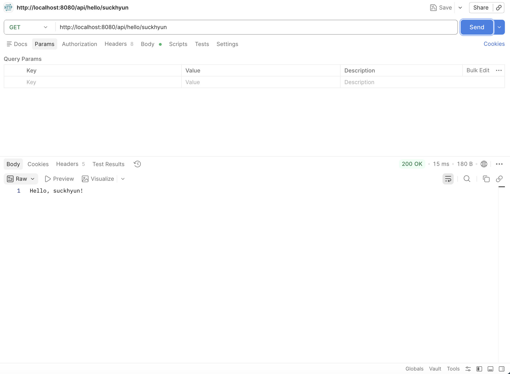
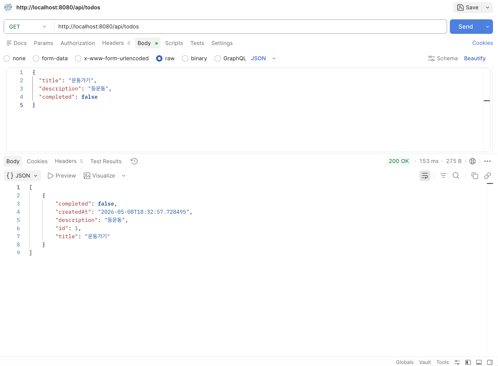
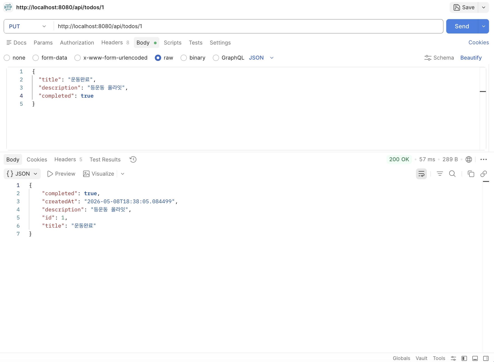
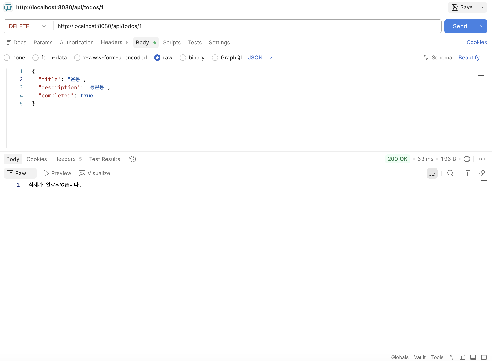
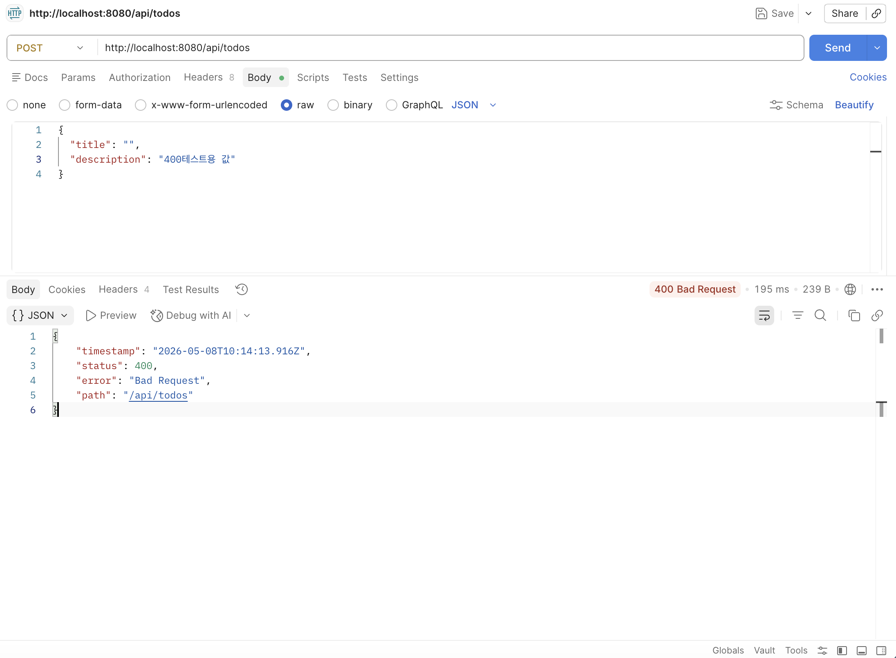
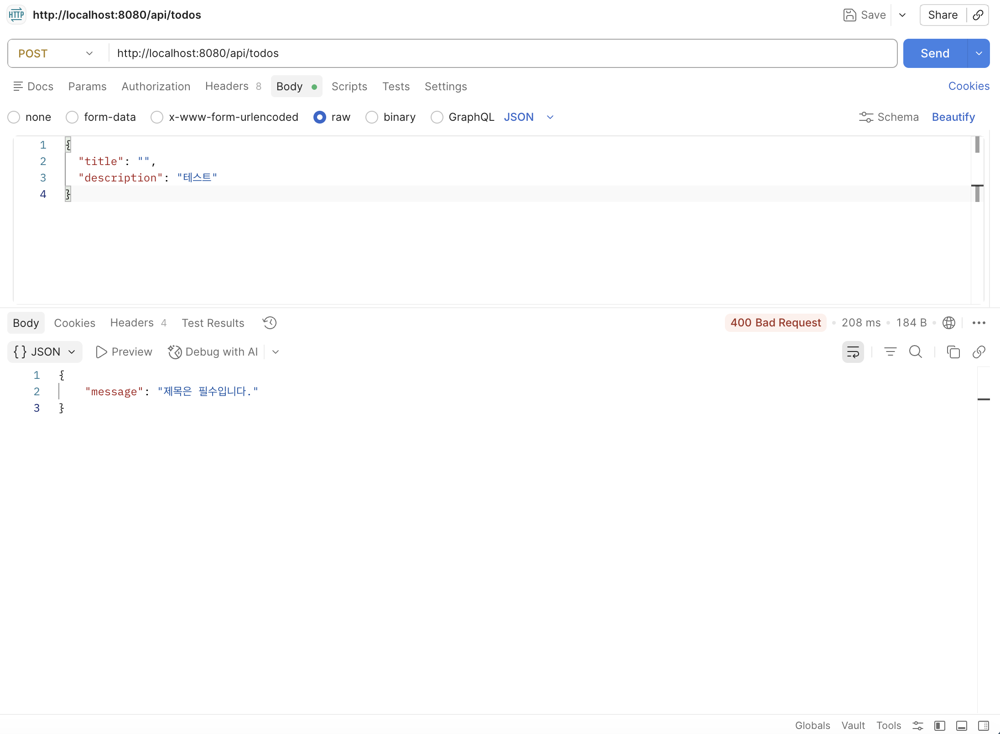
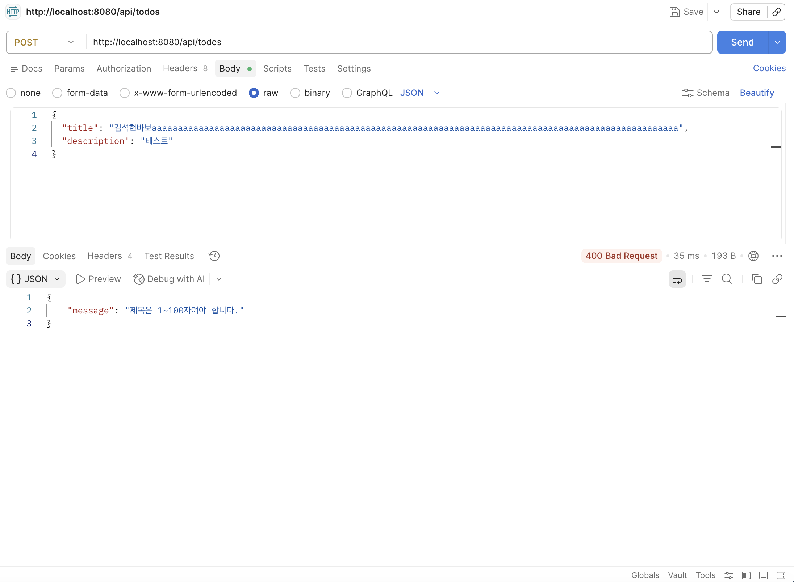
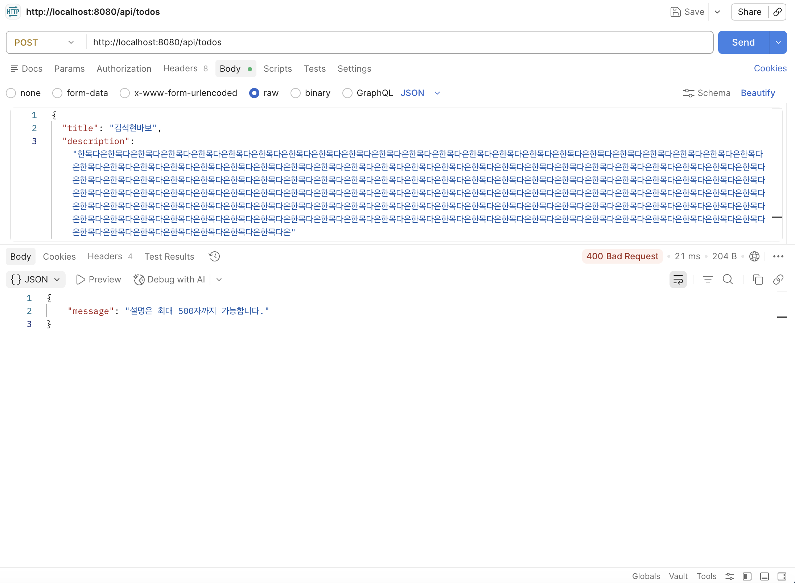

# 멋쟁이 사자처럼 4주차 Spring Boot Todo API 실습

## 👤 이름
정양효
## 깃허브 아이디
jyhyo02

---

## 📌 완료한 실습

### ✅ 실습 2B: Todo CRUD API (JPA + DB)

- Todo Entity 생성
- JpaRepository 사용
- CRUD API 구현
- H2 Database 연결

### ✅ 실습 3: DTO 사용하기

- TodoRequestDTO
- TodoResponseDTO
- Controller / Service DTO 적용

### ✅ 실습 4: 예외 처리

- TodoNotFoundException 구현
- GlobalExceptionHandler 구현
- ErrorResponse DTO 구현
- 404 예외 처리 구현

### ✅ 실습 5: Validation 추가

- title 필수 검증
- title 길이 제한 (1~100자)
- description 길이 제한 (최대 500자)
- @Valid 적용
- Validation 실패 시 400 응답 구현

---

# 🛠 사용 기술

- Java 21
- Spring Boot
- Spring Web
- Spring Data JPA
- H2 Database
- Gradle

---

# ▶️ 실행 방법

## 1. 프로젝트 클론

```bash
git clone https://github.com/본인깃허브주소.git
```

## 2. 프로젝트 이동

```bash
cd practice5-validation
```

## 3. 실행

Mac/Linux:

```bash
./gradlew bootRun
```

Windows:

```bash
gradlew.bat bootRun
```

---

# 📮 API 엔드포인트

| Method | URL | 설명 |
|---|---|---|
| GET | /api/todos | 전체 조회 |
| GET | /api/todos/{id} | 단건 조회 |
| POST | /api/todos | Todo 생성 |
| PUT | /api/todos/{id} | Todo 수정 |
| DELETE | /api/todos/{id} | Todo 삭제 |

---

# 🧪 Postman 테스트 예시

## POST 요청

```json
{
  "title": "스프링 공부",
  "description": "Validation 테스트",
  "completed": false
}
```

---

# 📷 실행 결과 스크린샷

## practice1-hello




---

## practice2b-jpa/practice3-dto








---

## practice4-exception



---

## practice5-validation



