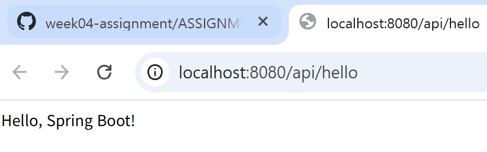
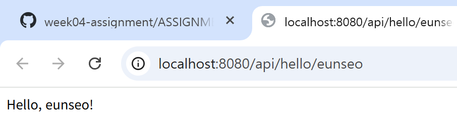
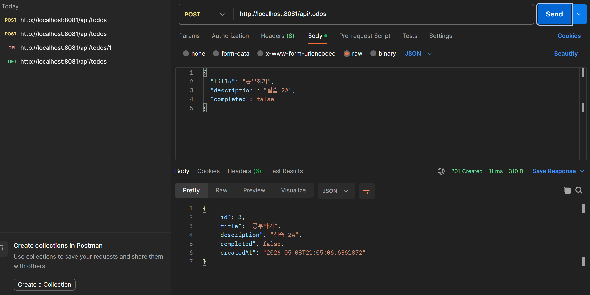
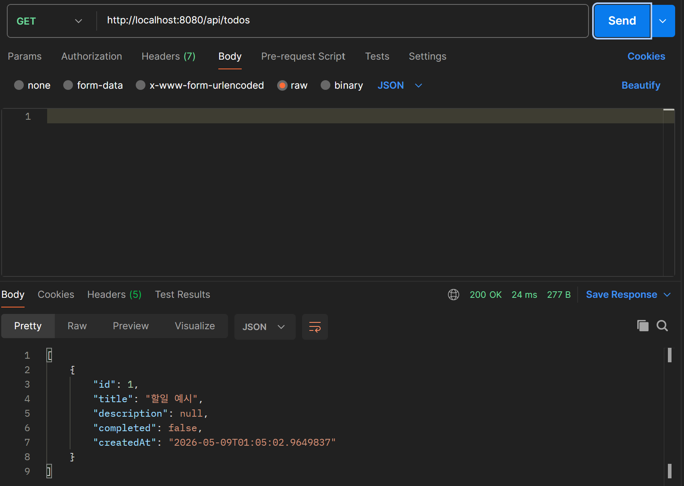
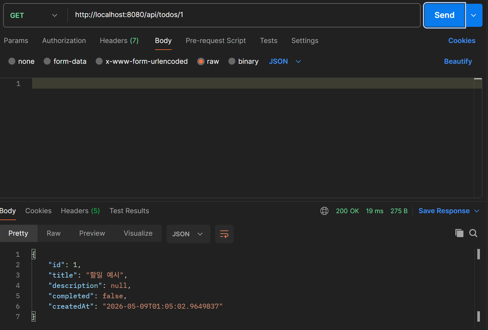
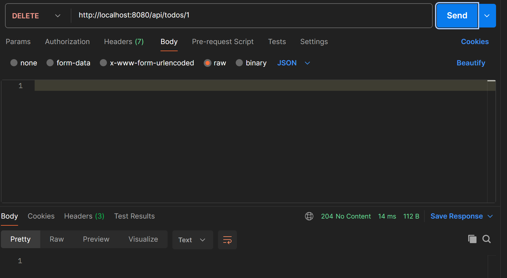
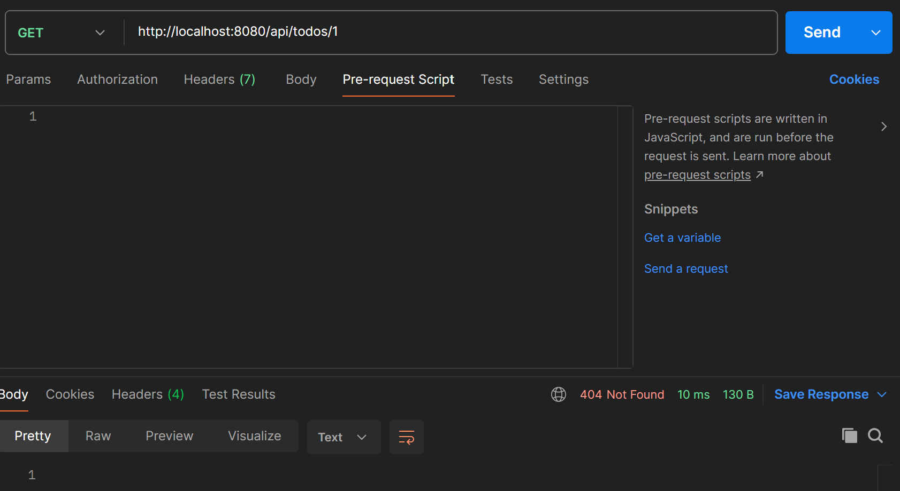

# 4주차 과제 제출

## 이름
- 이름: 박은서
- GitHub 아이디: peunseo

## 완료한 실습
- 실습 1: practice1-hello
- 실습 2A: practice2a-memory
- 실습 2B: practice2b-jpa

## 스크린샷

### 실습 1 — Hello REST API

### 실습 2A — 메모리 기반 Todo API

### 실습 2B — JPA Todo API

